<!-- App Icon -->
<p align="center">
  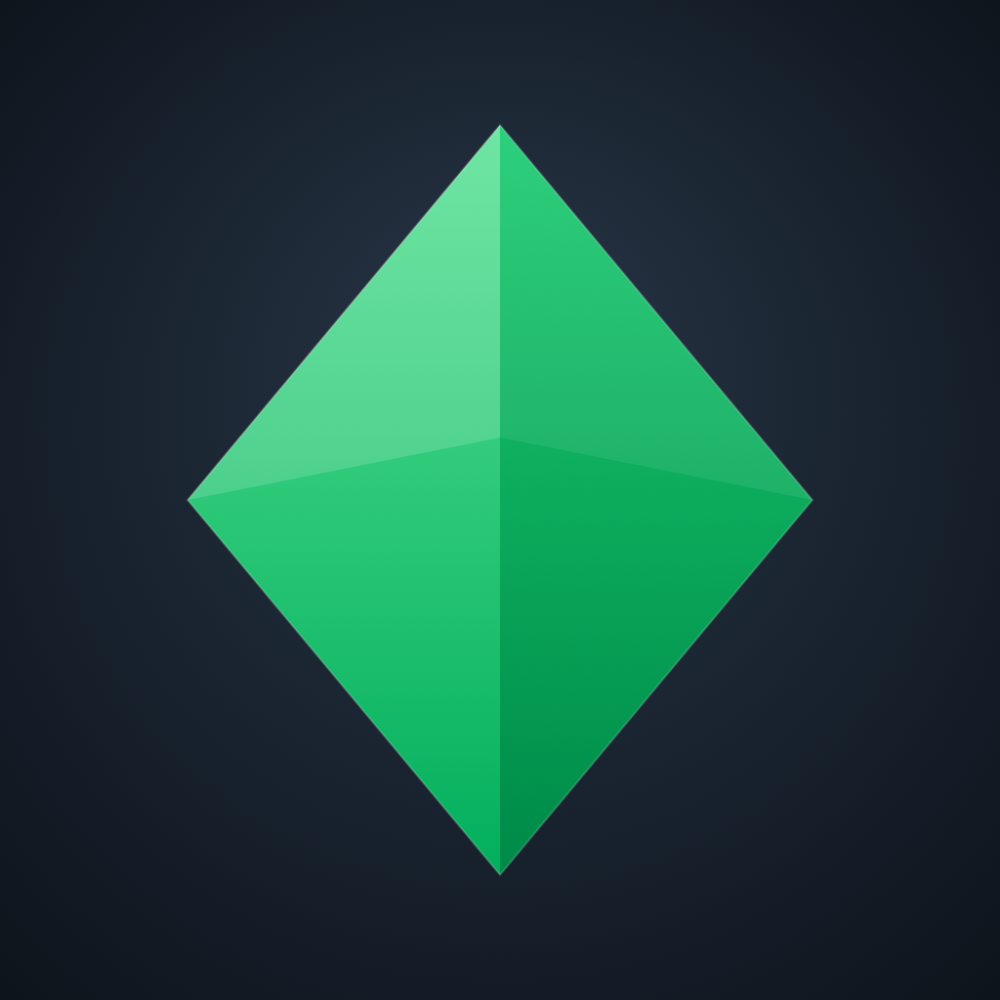
</p>

<h1 align="center">NextOutcome</h1>

<p align="center">
  <b>Polymarket, built native for iOS.</b><br/>
  Browse live prediction markets, watch order books move in real time, and follow a full
  World Cup hub — complete with a spinning 3D globe of nation odds. Read-only today,
  on-chain trading is next.
</p>

<p align="center">
  
  
  
  
</p>

<p align="center">
  ⭐ If you like what you see, star the repo — clone instructions are below.
</p>

---

## Table of Contents

- [Why NextOutcome](#why-nextoutcome)
- [App Screenshots](#app-screenshots)
- [Demo GIF / Video](#demo-gif--video)
- [Features](#features)
- [Tech Stack](#tech-stack)
- [Architecture](#architecture)
- [Folder Structure](#folder-structure)
- [Getting Started](#getting-started)
- [Testing](#testing)
- [Privacy & Permissions](#privacy--permissions)
- [Project Status](#project-status)
- [Roadmap](#roadmap)
- [Contributing](#contributing)
- [Security](#security)
- [License](#license)
- [Acknowledgments](#acknowledgments)
- [Author](#author)

---

## Why NextOutcome

[Polymarket](https://polymarket.com) lives in a browser. NextOutcome brings its markets, order
books, and live sports data to a proper native iOS app — smooth scrolling feeds, real-time
WebSocket order books, live-updating charts, and a World Cup hub with an interactive 3D globe.
No wallet required to explore: browsing, order books, live stats, and portfolio tracking are all
watch-only today, with on-chain trading actively on the roadmap.

---

## App Screenshots

> Captured from the current dev build in the simulator — not a final/curated set.

| | | |
|---|---|---|
| 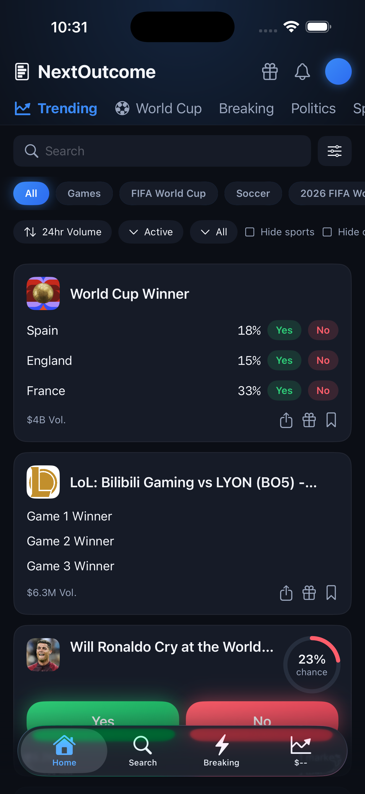<br/>Home feed — Trending | 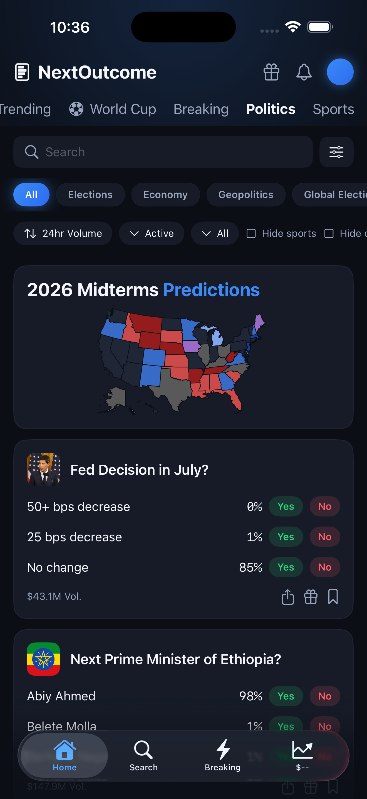<br/>Home feed — Politics | 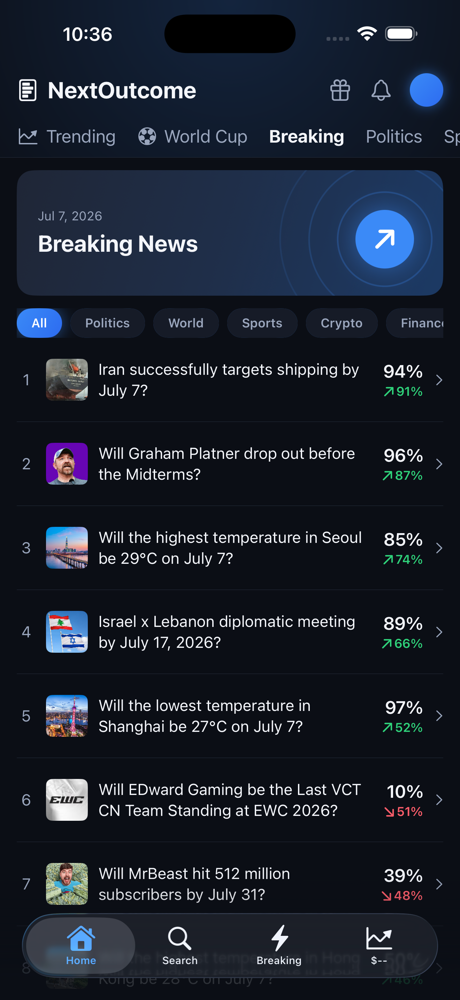<br/>Home feed — Breaking |
| 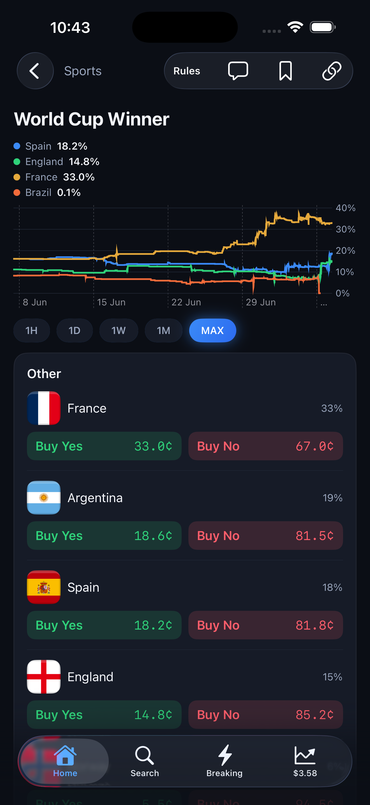<br/>Trending — World Cup winner odds | 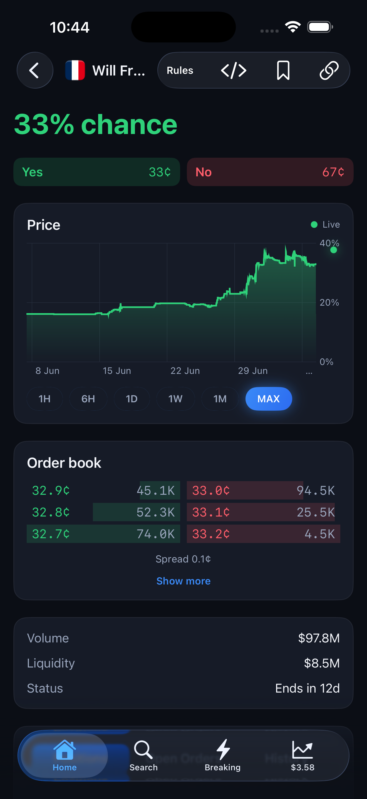<br/>France-to-win market | 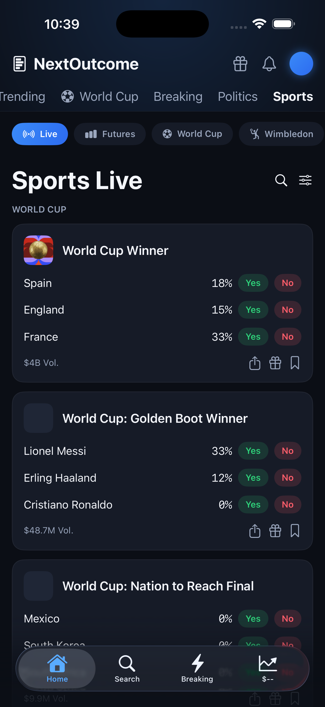<br/>Sports hub — Live feed |
| 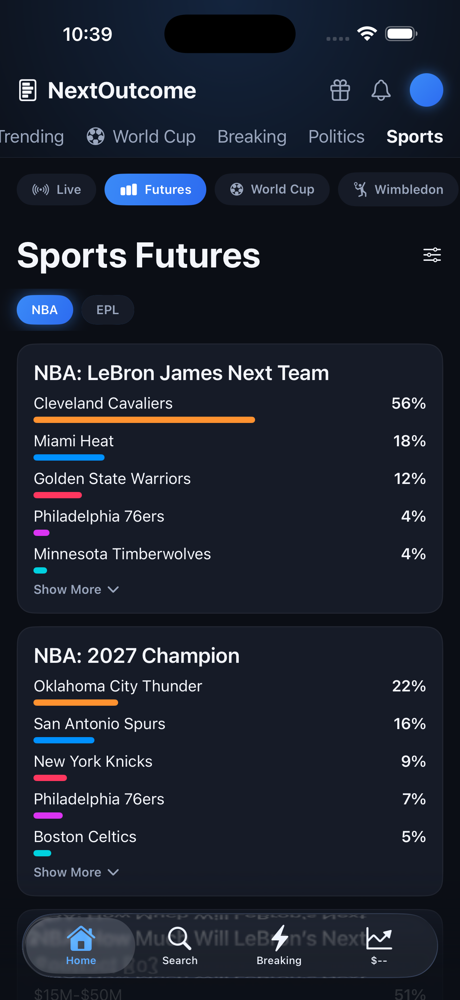<br/>Sports hub — Futures | 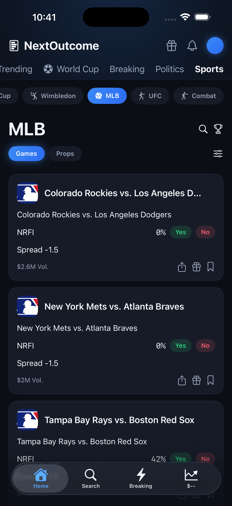<br/>Sports hub — MLB league | 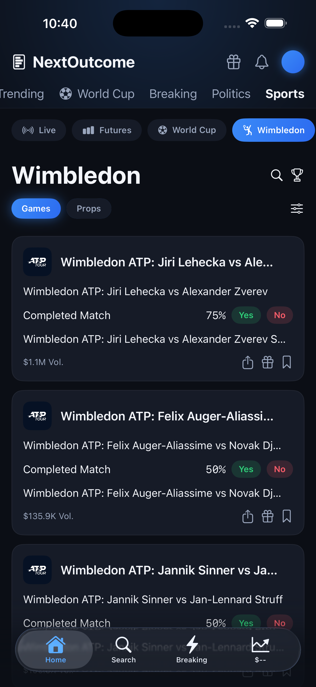<br/>Sports hub — Wimbledon league |
| 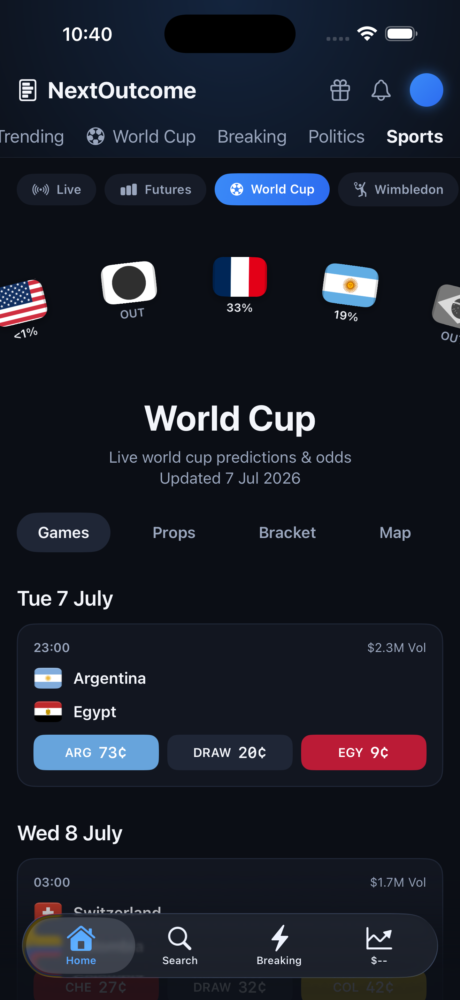<br/>Sports hub — World Cup league | 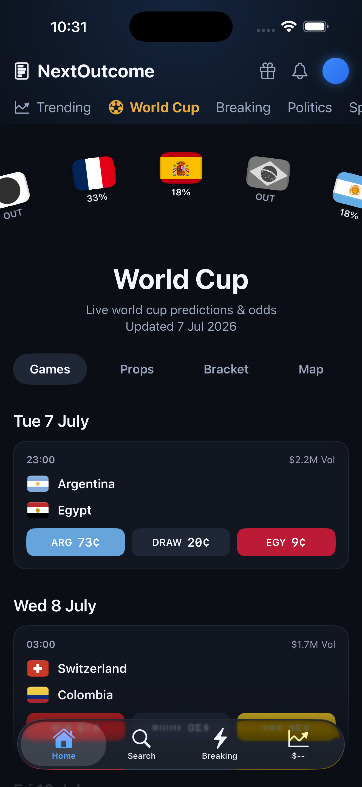<br/>World Cup hub — Games schedule | 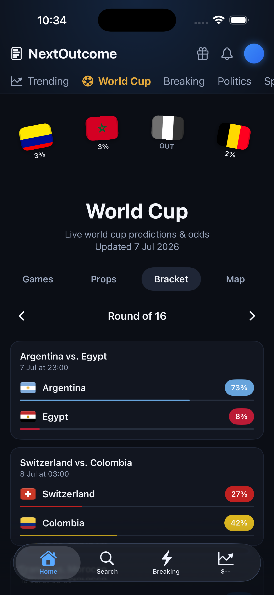<br/>World Cup hub — Bracket |
| 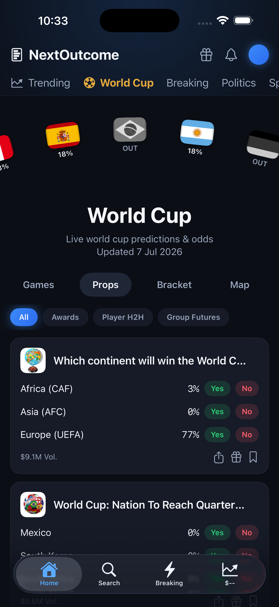<br/>World Cup hub — Props | 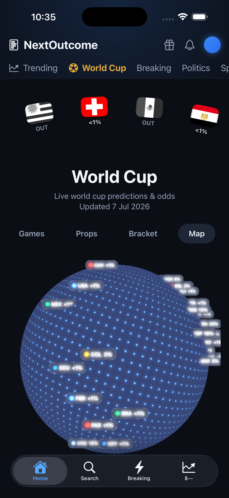<br/>World Cup hub — Map (SceneKit globe) | |

---

## Demo GIF / Video

| World Cup hub navigation | World Cup Map — SceneKit globe |
|---|---|
| 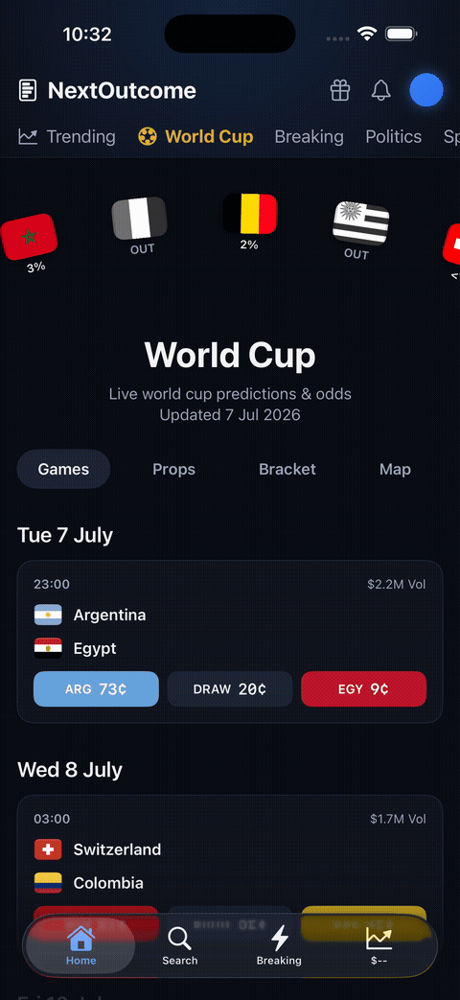 |  |

---

## Features

- **Markets feed** — trending, a dynamic category rail (pinned tabs plus curated categories like Crypto/Esports resolved live from Gamma tags), sort/status filters, and hide-sports toggle, with infinite scroll.
- **Search** — debounced full-text market search.
- **Event & market detail** — multi-series price chart with selectable timeframes, a "% chance" header, grouped market sections (moneyline / spreads / totals), rules expander, and a sticky header on scroll.
- **Live order book** — expandable depth ladder streamed over WebSocket with transparent reconnect/back-off, plus spread and cumulative-size depth bars.
- **Crypto hub** — classifies markets into Up/Down, Above/Below, Price Range, and Hit Price, with sort/period/timeframe filters and search. Up/Down cards open a **live BTC detail screen**: server-clock countdown, price-to-beat delta, a Price/Chance/Candles chart, live quick-bet buttons, and a recent-trades ticker.
- **Live sports stats** — score hero, minute timeline, stats, pitch, lineups, and commentary, streamed from the public sports feed.
- **World Cup hub** — Games schedule, Props (awards / player H2H / group futures), a Bracket carousel (Groups → knockout rounds), and a Map tab with a rotating, draggable **SceneKit globe** of nation odds.
- **Portfolio (watch-only)** — track any wallet's open/closed positions, activity feed, and the trader leaderboard. No keys, no custody.
- **Social strip** — comments, top holders, and recent activity per event.
- **Light/Dark theme** — app-wide toggle from the drawer, persisted locally, independent of system appearance.
- **Mock trade sheet** — keypad amount entry with a live "to win" payout. **Simulated only** — sends nothing, stores nothing — until real trading lands.

---

## Tech Stack

| Layer | Choice |
|---|---|
| **Language** | Swift 5.9 |
| **UI** | SwiftUI, Swift Charts, SceneKit (3D globe) |
| **Concurrency** | Swift Concurrency — `async/await`, actors, `AsyncStream` / `AsyncThrowingStream` |
| **State** | Observation (`@Observable`), MVVM view models |
| **Networking** | `URLSession` for REST **and** WebSockets (order book + sports feeds) |
| **Persistence / security** | Keychain (session token), `UserDefaults` (watched wallet) |
| **Modularization** | Swift Package Manager (one umbrella package, ~18 targets) |
| **Logging** | `os.Logger` |
| **Backend** | Polymarket public APIs — **Gamma** (markets/events/tags/comments), **Data** (positions/holders/trades/leaderboard/geoblock), **CLOB** (order book, price history, server time), and the sports/market WebSocket channels |

---

## Architecture

**Clean Architecture (Domain / Data / Presentation) + MVVM**, following SOLID:

- **Domain** — pure entities, use cases, and repository *ports* (protocols). No I/O, no UI, trivially testable.
- **Data** — DTOs, tolerant decoders for Polymarket's quirky wire shapes, mappers, and the concrete repository/socket implementations.
- **Presentation** — `@Observable` view models and SwiftUI views. Dependencies are injected via protocols and environment-provided factories, so views never import the Data layer.

The app is a **thin composition root**: [`AppContainer`](NextOutcome/NextOutcome/App/AppContainer.swift) wires concrete implementations once and vends ready-made view models and factories to [`RootView`](NextOutcome/NextOutcome/App/RootView.swift). Each feature is a **vertical slice** with its own `*Domain` / `*Data` / `*Presentation` modules. The Trading modules are deliberately quarantined — the read-only app never links them.

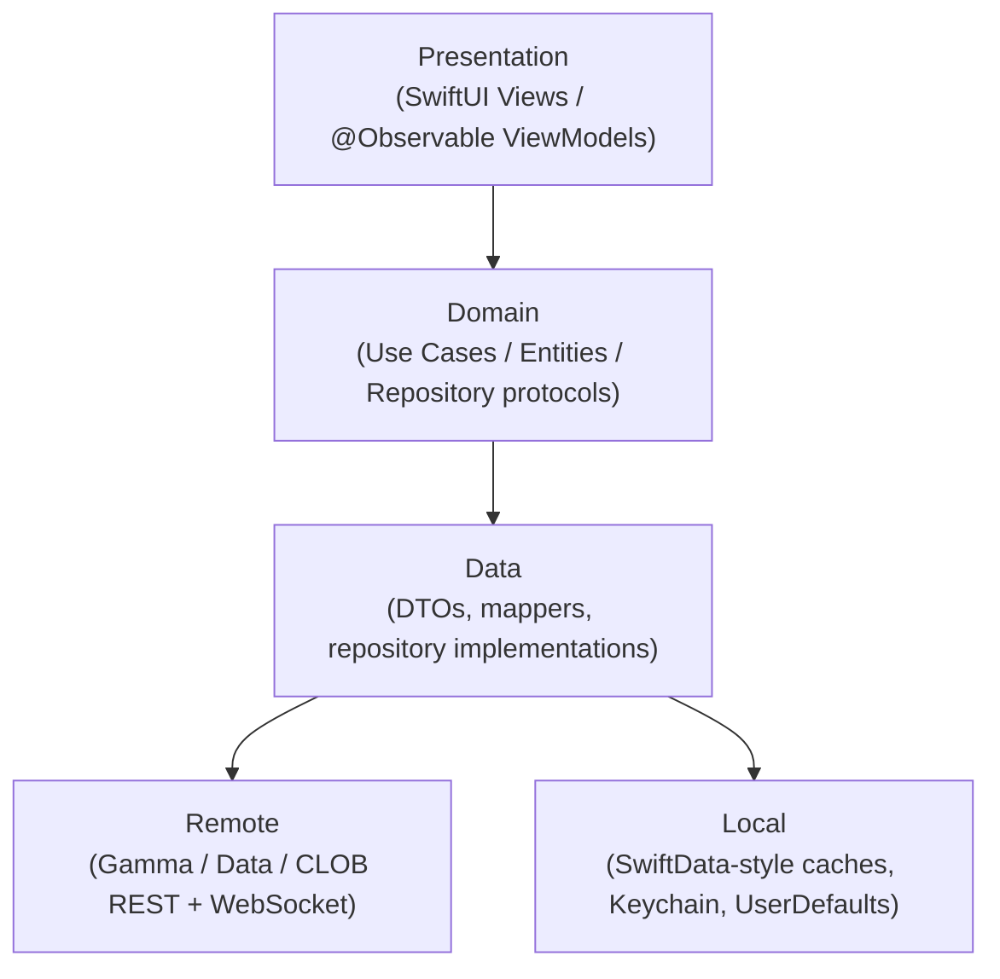

**Key decisions**
- Presentation depends only on Domain's Use Case protocols — it never imports a feature's `Data` module; the App composition root wires the concrete repository in.
- `SharedDomain` holds cross-feature primitives (`LoadState`, `Page`) so features don't import each other directly.
- The Trading feature (order signing + proxy) is a separate, optional module the read-only app never links — see [`docs/phase-4-wallet-proxy-design.md`](docs/phase-4-wallet-proxy-design.md).

---

## Folder Structure

```
NextOutcome/
├── README.md
├── NextOutcome/                         # Xcode project root
│   ├── NextOutcome.xcodeproj
│   ├── NextOutcome/                      # App target (thin shell)
│   │   └── App/                          # AppContainer, RootView
│   └── Packages/                         # Swift Package (one umbrella)
│       ├── Package.swift
│       ├── Core/
│       │   ├── DesignSystem/             # tokens, components, shell chrome
│       │   └── Networking/               # APIClient (actor), Endpoint, sockets, decoding
│       ├── SharedDomain/                 # LoadState, Page — cross-feature primitives
│       └── Features/                     # vertical slices: Domain / Data / Presentation
│           ├── Markets/                  # feed, detail, search, World Cup hub
│           ├── Orderbook/                # live book, price/candle charts, BTC live
│           ├── Portfolio/                # watch-only positions, activity, leaderboard
│           ├── LiveStats/               # live sports stats
│           └── Trading/                  # order signing + proxy (quarantined)
└── .mobile-agents/                       # engineering standards & agent toolkit
```

---

## Getting Started

Clone it, open it, run it — no API keys, no signup.

### Requirements

- **macOS** with **Xcode 15+** (Swift 5.9 toolchain)
- **iOS 17+** target (the app uses `@Observable`, `ContentUnavailableView`, and modern `.task` APIs)
- A physical device or the iOS Simulator
- Internet access (the app reads Polymarket's public APIs)

### Installation

```bash
git clone https://github.com/sokpichdev/NextOutcome.git
cd NextOutcome
open NextOutcome/NextOutcome.xcodeproj
```

Xcode resolves the local Swift package under `NextOutcome/Packages` automatically on first open.

### Configuration

- **No secrets or API keys are required** for the read-only experience — all Polymarket endpoints used are public.
- **Portfolio** is watch-only: paste any `0x…` wallet address to track it. Nothing is signed or funded.
- **Trading** is simulated. Real trading will require a backend proxy (`TradingProxyConfig`) and a vetted on-device signer; both are stubbed today.

### Build & Run

**In Xcode:** select the `NextOutcome` scheme and an iOS 17+ simulator, then press **⌘R**.

**Build the packages from the command line:**

```bash
cd NextOutcome/Packages
swift build
```

---

## Testing

```bash
cd NextOutcome/Packages
swift test
```

Each feature slice (Markets, Orderbook, Portfolio, LiveStats, Trading) has its own `*DomainTests` and `*DataTests` targets — Domain tests exercise Use Cases against stub repositories, Data tests exercise DTO decoding against fixture JSON. `Networking` and `DesignSystem` have their own test targets too. There's no CI wiring yet, so `swift test` is run locally before merging; a formal coverage target hasn't been set (see [Roadmap](#roadmap)).

---

## Privacy & Permissions

- **No permissions requested** — no camera, location, or notification usage descriptions in `Info.plist` today.
- **No analytics or crash reporting** — zero third-party dependencies in `Package.swift`; the only instrumentation is `os.Logger`.
- **Data entered:** a wallet address (`0x…`) to watch a portfolio, stored locally in `UserDefaults` and used only to query Polymarket's own public Data API directly. Nothing is sent to a first-party backend today.

---

## Project Status

🚧 **In active development.** Browsing (with a dynamic, tag-resolved category rail), live order books, the Crypto hub with a live BTC detail screen, live sports/World Cup, the watch-only portfolio, and app-wide light/dark theming are implemented. Trading is **mock/simulated** pending wallet + proxy integration and funding.

---

## Roadmap

- [x] Markets feed, search, event/market detail with live charts
- [x] Live order book over WebSocket with reconnect/back-off
- [x] Live sports stats and the World Cup hub (schedule, props, bracket, 3D globe map)
- [x] Watch-only portfolio (positions, activity, leaderboard) by wallet address
- [x] Dynamic category rail — curated categories (e.g. Crypto, Esports) resolved live from Gamma tags
- [x] Crypto hub — Up/Down, Above/Below, Price Range, Hit Price markets, plus a live BTC detail screen
- [x] App-wide light/dark theme toggle, persisted locally
- [x] 1024pt app icon (light/dark/tinted variants)
- [ ] Real on-chain trading — vetted EIP-712 signer + backend proxy (currently simulated)
- [ ] Wallet connect & session auth
- [ ] Portfolio funding and real positions on market detail
- [ ] Push notifications for price moves and market resolutions
- [ ] Polished screenshots, demo video, and App Store assets covering the Crypto hub and theming
- [ ] Expanded test coverage across feature slices, and CI wiring

---

## Contributing

This is currently a solo project, but contributions are welcome:

1. Fork and create a feature branch (`git checkout -b feat/thing`)
2. Keep changes scoped to a feature's vertical slice (`Domain`/`Data`/`Presentation`) per the [Architecture](#architecture) rules
3. Make sure `swift test` passes from `NextOutcome/Packages`
4. Open a PR against `main`

---

## Security

The app is read-only and non-custodial today — no wallet keys, no funds at risk. If you find a security issue, please open a GitHub issue or reach out to the author directly rather than disclosing it publicly.

---

## License

To be determined. <!-- TODO: choose a license (e.g. MIT) and add a LICENSE file. -->

---

## Acknowledgments

- [Polymarket](https://polymarket.com) — the public Gamma, Data, and CLOB APIs this app is built entirely on.

---

## Author

**Sok Pich** — [@sokpichdev](https://github.com/sokpichdev)

If you're building something similar or want to talk iOS/prediction markets, open an issue or reach out on GitHub.
